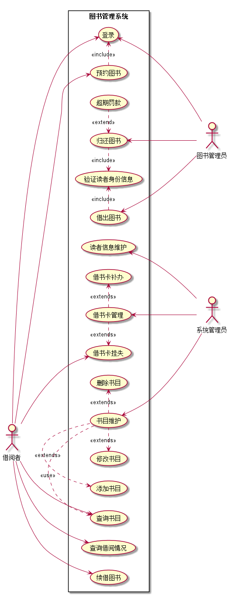

# 实验二：图书管理系统用例建模
|        学号      |     班级    |    姓名    |
|:----------------:|:-----------:|:----------:|
|   201510414301   |    软工15-3 |    程鑫凯  | 
## 1.图书管理系统的用例关系图
### 1.1用例图PlantUML源码如下：
    @startuml
    
    left to right direction
    :系统管理员: as SysAdmin
    :图书管理员: as Admin
    :借阅者: as User
    
    
    rectangle 图书管理系统{
    User --> (登录)
    User --> (查询借阅情况)
    User --> (预约图书)
    (预约图书).>(登录):<<include>>
    User --> (续借图书)
    User --> (查询书目)
    User --> (借书卡挂失)
    
    (借出图书).>(验证读者身份信息):<<include>>
    (借出图书) <-  Admin
    (验证读者身份信息)<.(归还图书):<<include>>
    (归还图书)<.(超期罚款):<<extend>>
    (归还图书) <- Admin
    (登录)<--- Admin
    
    (读者信息维护) <- SysAdmin
    (借书卡管理).>(借书卡补办):<<extends>>
    (借书卡管理) <- SysAdmin
    (借书卡挂失)<.(借书卡管理):<<extends>>
    (书目维护) <--- SysAdmin
    (书目维护).>(删除书目):<<extends>>
    (修改书目)<.(书目维护):<<extends>>
    (添加书目)<.(书目维护):<<extends>>
    (查询书目)<.(书目维护):<<use>>
    }
    
    @enduml
### 1.2用例图如下：

## 2.参与者说明
### 2.1 系统管理员
主要职责是：系统管理员负责系统的管理维护工作，维护工作包括图书的添加、删除和修改，书目的添加和删除，借阅者的添加、删除和修改，并且系统管理员能够查询借阅者、图书和图书管理员的信息。
### 2.2 图书管理员
主要职责是：对读者的借书、还书等操作进行处理，还书时若读者逾期应对其收取罚款。
### 2.3 借阅者
主要职责是：可以通过查询图书并借取或者归还图书，也可查询自己的借阅情况。若借记卡不慎丢失，可进行挂失并找系统管理员进行补卡操作。
## 3.用例规约表
### 3.1 "借出图书"用例
| | |
|:------:|:------:|
|用例名称|借出图书|  
|参与者|图书管理员（主要参与者）、借阅者（次要参与者）|
|前置条件|图书管理员已被识别和授权|
|后置条件|存储借书记录，更新库存数据，所借图书状态为借出|
|主事件流|1.图书管理员将读者借书卡提供给系统；2.系统验证读者身份和借书条件；3.图书管理员将读者所借图书输入系统；4.系统记录借书信息，并且修改图书的状态和此书的可借数量；5系统累加读者的借书数量；6.重复3~5，直到图书管理员确认全部图书登记完毕；7.系统打印借书清单，交易成功完成|
|备注|无|
 ### 3.2 "归还图书"用例
 | | |
 |:------:|:------:|
 |用例名称|归还图书|  
 |参与者|图书管理员（主要参与者）、借阅者（次要参与者）|
 |前置条件|图书管理员已被识别和授权|
 |后置条件|存储还书记录，更新库存数据，所借图书状态为未借出|
 |主事件流|1.图书管理员将读者借书卡提供给系统；2.系统验证读者身份和还书条件；3.图书管理员将读者所借图书输入系统；4.由系统计算出图书所借日期是否逾期，若逾期则需要借阅者缴纳逾期罚款 5.系统记录还书信息，并且修改图书的状态和此书的可借数量；6.系统打印还书清单，交易成功完成|
 |备注|无|
 ### 3.3 查询个人信息
 | | |
 |:---:|:----:|
 |用例名称|查询个人信息|
 |参与者|借阅者|  
 |前置条件|图书馆的主页面正常运行，网络通信良好|  
 |后置条件|如果读者信息无误，则查询成功，否则失败。|
 |主事件流| 1.读者在图书管理系统上进行查询；2.系统管理员对读者的个人信息进行查询；3.读者向系统管理员提出申请未通过；4.用户重新提出申请；5.系统管理员重新审核。| 
 |备注|无|
 ### 3.4 查询图书信息
  | | |
  |:---:|:---:|
  |用例名称|查询图书信息|
  |参与者|借阅者（主要参与者），系统管理员（主要参与者）|  
  |前置条件|借阅者已经打开图书馆系统的页面，并登录，进入查询书库界面 | 
  |后置条件|页面将返回到学院图书馆系统主页面 |
  |主事件流|  1.借书者、图书管理员、系统管理员打开图书馆系统的页面；2.借书者、图书管理员、系统管理员进入查询书库页面； 3. 借书者、图书管理员、系统管理输入要查询的书名/编者/版本/分类...；4. 借书者、图书管理员、系统管理点击确定查找； 5. 系统开始搜索相关的图书，若有则显示所有相关图书的条目，若无则 提示“非常抱歉，暂时没有此书目”| 
  |备注|无|
  
### 3.5 预订图书
   | | |
  |:---:|:---:|
  |用例名称| 预约图书 | 
  |参与者| 借书者（主要参与者）、图书管理员（次要参与者）|  
  |前置条件| 借书者已经打开图书馆系统的页面，并登录，进入图书预定界面| 
  |后置条件|  页面将返回到学院图书馆系统主页面|
  |主事件流|  1. 借书者、图书管理员打开学院图书馆系统的页面； 2. 借书者、图书管理员进入图书预定页面；  3. 借书者、输入要预定的书名/编者/版本...； 4. 借书者、点击确定查找；  5. 借书者、在结果中选择需要预定的图书进行预定； 6. 双击选择要预定的图书，确认提交预定|  
 | 备注|  无|
### 3.6 解除预订
   | | |
  |:---:|:---:|
 |用例名称| 解除预订|
 |参与者|借书者（次要参与者），图书管理员（主要参与者）|  
 | 前置条件|用户进行过图书预订| 
 |后置条件|用户解除预订成功|
 |主事件流|1.图书管理员选择“取消预订登记”，提交“取消预订登记”请求；2.系统显示“取消预订登记”窗口； 3.借书者输入预订登记信息； 4.系统列表显示出该读者预订图书信息； 5.借书者选择取消预订；6.若用户之前进行过预订，则取消成功。若用户之前没有进行过预订，则转入6.1.1 |  
 |备注| 无|
### 3.7 超期罚款
   | | |
  |:---:|:---:|
  |用例名称|超期罚款|
  |参与者| 借书者、图书管理员| 
  |前置条件| 图书管理员登录系统 |
  |后置条件| 系统更新图书信息| 
  |主事件流|  1. 管理员进入学院图书馆系统； 2. 管理员打开借还书页面； 3. 管理员扫描图书读入图书信息； 4. 管理员扫描食堂卡读入读者信息；  5. 管理员点击还书按钮，在弹出的确认窗口点击确认按钮； 6. 系统检测读者信息图书信息，确认是否可以进行还书操作；  7. 系统进行超期罚款操作；  8. 系统进行还书操作，更改数据库； 9. 提示还书成功。|
  |备注|无|
